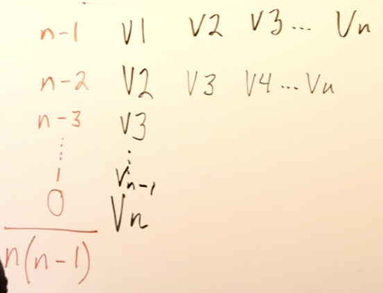

# Graphs
- Graph theory: graphs are a way to formally represent a network with ordered pairs, G = (V, E) for a set of vertices and a set of edges
- **Vertices**: dots, represent data
  - |V|: # vertices
- **Edges**: lines, relationship between data points
  - |E|: # edges
  - Can assign **weight** and **direction** (like a vector or double arrowed): must be all un/weighted, or all have/not have direction
- Trees are graphs with more restrictions


- Sparcity: measured by density
  - Density = |E| / (|V| * (|V| - 1)), max of 1, min of 0
    - Max is 2 for directional graphs
    - 
- Important bc dense graphs O() slow, sparse faster

## Examples
Facebook
- Vertices: individual FB users
- Edges: friends (A—B if are friends, no direction bc friends go both ways, no point)
- Subgraphs likely dense: families, grades

Twitter
- Vertices: users
- Edges: followers (A -> B if A following B)
- Subgraphs likely dense: families, grades

Trees
- Has n vertices and n - 1 edges -> no cycles (can't find circular path back to same vertices as starting vertex), no lone vertices,
- Ex.: DOM
  - Vertices: elements
  - Edges: direct parents/children, no directions
- Density of tree = 1 / n = (n - 1) / (n * (n - 1))
  - Typically always sparse, bc 1/1000, etc.

Map
- Vertices: states
- Edges: neighbors (minimum of 3/state)
  - Use: random coloring, neighboring two never same
- Dense

Dependency Set
- Vertices: ex. tasks
- Edges: TaskA -> TaskB if B depends on A (A must be done before
- No cycles: sort of infinite loop
- Often need order: topological sort

## Implementation
```rb
class Graph
  def initialize
    @vertices = []
    @edges = []
  end

  def create_edges
    # rep with 2D matrix, 0 for no edge, 1 for right, -1 for left arrow
  end
end

class Vertex
  def initialize(data)
    @data = data
    # @in_edges = [vertices]
    # @out_edges = [vertices]
  end
end

# class Edge
#   def initialize(A, B)
#     @vertices = [A, B]
#     @weight = 1
#   end
# end
```

# Topological Sort
- Concept
  - 1st layer: vertices w/o in_edges (not dependent on any) -> remove all out_edges of first layer
  - 2nd layer: vertices w/o in_edges -> remove all out_edges
  - 3rd: continue
- Not unique: each layer can be ordered however

## Algorithm Implementations
- Kahn's Algorithm
  1. Queue << indices w/o in_edges
  2. Pop off vertices from queue
    a. Remove popped vertex and its edges from graph
    b. Push into sorted array
    c. Find out_edges
    d. Push destination vertex if it has no in_edges
- Coffman Graham
- Modifying DFS

## Use Cases
- Task/dependencies
- Webpack and similar files structures, etc.
- Schedule tasks given scheduling restrictions
- Minimal spanning tree: minimum set of edges get to all vertices
