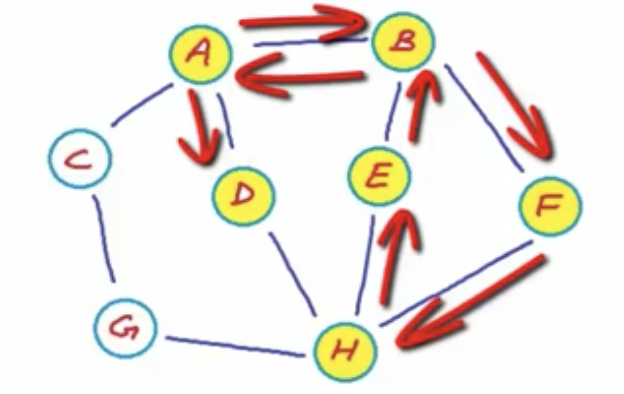

# W1D1

## Algorithms
Intro
- How do we define a graph mathematically?
  - **G = (V, E)** for an ordered pair G of a set of vertices and a set of edges
- What is the difference between directed, undirected, weighted, and unweighted?
  - **Directed edge**: ordered pair w origin and destination (u, v) forming an undirected graph
  - **Undirected edge**: unordered pair {u, v} forming a digraph/directed graph
  - **Weighted edge**: can represent priority, length, cost, any difference in the connection
  - **Unweighted edge**: all of equal weight of 1 unit
- Give an example of various types of graphs (Weighted Undirected, Unweighted Directed, Unweighted Undirected, etc.)
  - Twitter (unweighted directed), FB (unweighted undirected), intercity roads (weighted, by rd length, undirected), intracity roads (weighted directed, by one-way/two-way rds)

Properties of Graphs
- What makes a graph a simple graph? What attributes would make it not simple?
  - **Simple graph**: w/o self loops or multi-edges
  - **Self loop**: edge's origin and destination are the same
    - Ex.: webpage has a link to itself
  - **Multi-edge/parallel edge**: two edges from same origin to same desination
    - Ex.: flight maps, 2 flights from 1 airport to the same airport
- What is the maximum number of edges in a directed simple graph? Undirected simple graph? Answer should be in terms of N.
  - Directed simple # edges: 0 ≤ |E| ≤ n(n - 1)
  - Undirected simple # edges: 0 ≤ |E| ≤ (n(n - 1)) / 2
  - **Dense** vs **sparse** graph: # edges
    - **Adjacency matrix**: to store dense graph
    - **Adjacency list**: to store sparse graph
- Describe the levels of connectivity a graph can have (strongly connected, weakly connected).
  - **Walk/path**: sequence of adjacent vertices connected w edges (in directional, edges must flow in 1 direction)
    - 
    - **Path/simple path**: no vertices (thus no edges) repeated, <A, B, F, H>
    - **Trail**: no edges repeated
    - **Strongly connected graphs**: if there is path from any vertex to any other
      - **Connected**: strongly connected undirected
    - **Weakly connected**: directed graph that can be connected if edges were undirected
- What are cycles?
  - **Closed walk**: starts and ends at same node, length > 0
  - **Simple cycle**: no repetition except start and end
  - **Undirected/directed cyclic graph**: no cycle

Graph Representation
- What are some naive ways we can store and traverse graphs? Discuss time/space complexity and associated issues.
  - Vertex list and edge list: dynamic arrays, edges stored as objs w startVertex, endVertex, weight
    - Space: O(|V| + |E|)
    - Time: O(|E|) to find adjacent nodes, O(|E|) nodes connected
      - Bad: O(|E|) = O(|V| * (|V| - 1)) or ~ O(|V|^2)
  - Replace vertex list array w hash table
  - Vertex list and adjacency matrix (2D matrix, 0 or 1 or weight of edge at idxs of nodes)
    - Space: O(|V|^2) waste a lot of space storing 0s
    - Time: O(|V| + |V|) find adjacent nodes by scanning vertex list to find idx then row in adj matrix at that idx, O(|V| + 1)  finding if 2 nodes connected by scanning vertex list, then keying into adj matrix there

## Web
- REST: Representational State Transfer
- What are the three primary Fielding constraints? (Bonus if you can say who Fielding is!)
  1. Client-server: network made up of clients and servers
  2. Stateless: servers and clients don't need to keep track of the other's state
  3. Uniform interface: ensures common language between c and s to allow either to be modified wo breaking entire system
- What sub-constraints make up a Uniform Interface
- Walk through an arbitrary example of a RESTful request/response cycle, and describe what makes it RESTful

## JavaScript
- Give a high level overview of what an object's prototype represents
- What are the differences between the __proto__ and prototype attributes?
- What happens when we do or don't explicitly set an object's prototype?
- What is an object's default prototype?
- What are the valid values for an object's prototype?

## HTML/CSS
- Name 5 benefits of HTML5
  1. <!DOCTYPE html>
  2. Semantics: <header>, <footer>, <nav>, <section>, etc.
  3. Accessbility
  4. Audio/Video: <video src="" />
  5. Local storage: storage across multiple windows, better security and performance, data persists after browser closed
  6. Better interactions: <canvas>, and APIs like Drag and Drop, offline storage database, browser history management, timed media playback
- Why are media queries useful?
  - ```css
    @media only screen and (max-width: 600px) {
      body {
        background: lightblue;
      }
    }
    ```
- What is mobile-first design? Be as specific as possible.
  - Page displays faster on smaller screens
  - ```@media only screen and (min-width: 600px)```
