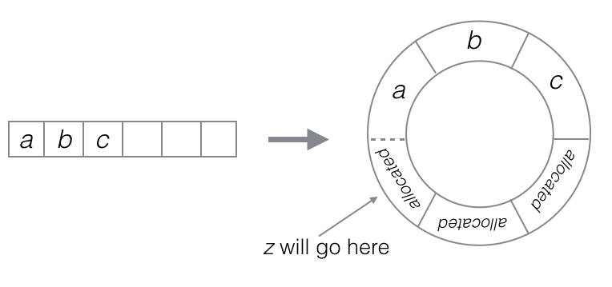

# Static & Dynamic Arrays Notes

- Ruby is wrapper for C -> C is wrapper for assembly language
- [] in C: fixed size (static arr) -> contiguous memory allocated for array storage

## Static Arrays
```rb
class StaticArray
  def initialize(length)
    @length = length
    @store = Array.new(length)
  end
  # ...
end
```

- #[](val) and #[]=(val): arithmetic, lookup at a specific memory location, and assignment are constant time -> O(1)
- #push: arithmetic and the assignment are constant time -> O(1)
- #delete: shifts elements over after deletion -> O(n)
  - O(n/2) average and O(n - 1) worst case

## Dynamic Arrays
```rb
class DynamicArray
  def initialize
    @length = 0
    @capacity = 8
    @store = StaticArray.new(@capacity)
  end
  # ...
end
```

- Dynamic array: dynamically changes capacity (doubles when length == capacity)
- #find: O(n), #delete: O(n)
- #push: O(n) time, but O(1) amortized time
- #pop: O(1)
- #shift, #unshift: still need to shift everything when elements move -> O(n)

## Ring Buffer
```rb
class RingBuffer
  def initialize
    @length = 0
    @capacity = 8
    @start_idx = 0
    @store = StaticArray.new(@capacity)
  end
  # ...
```


- ring buffer: so all methods are at least O(1) amortized!
- #unshift: place at the end and change start_idx -> O(n)
