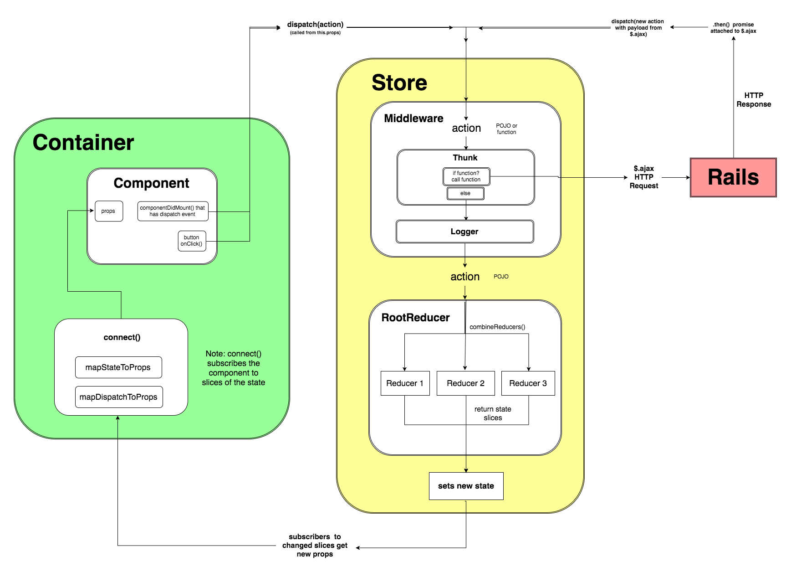

# REACT AND REDUX NOTES

## React vs. Redux

- Redux: yellow, the store, the single-source of truth
- React: green

## React Lifecycle Methods
Component Mount: initially insertion into DOM
1. ```constructor()```
2. ```componentWillMount()```: rarely used, won't trigger re-render if state changed
3. ```render()```
4. ```componentDidMount()```: recommended to set state

Update: props or state change
1. ```componentWillReceiveProps(nextProps)```: React tendency to call regardless of prop change
2. ```shouldComponentUpdate(nextProps, nextState)```: returns boolean, false --> ```componentWillUpdate()```, ```render()```, and ```componentDidUpdate()``` won't be called
3. ```componentWillUpdate()```: won't allow set state or other re-render triggers
4. ```render()```
5. ```componentDidUpdate()```: called right after update, where to make network requests

## Redux Store
- **Store**: central element of Redux's architecture w global state of an app, immutable
  - It 1. updates app's state via reducer 2. broadcasts state to an application's view layer via subscription 3. listens for actions that tell it how and when to change the global state
- ```createStore(reducer, [preloadedState], [enhancer])```
  - reducer (required): reducing function that receives the app's current state and incoming actions, determines how to update the store's state, and returns the next state
- Methods
  - ```getState()```: returns the store's current state.
  - ```dispatch(action)```: passes an action into the store's reducer telling it what information to update
  - ```subscribe(callback)```: registers callbacks to be triggered whenever the store updates (returns function, which when invoked, unsubscribes the callback function from the store)

## Selector
- Selector: functions used to extract and format parts of application state in specific forms
  - Goes in reducer folder

## React/Redux
Provider
- Provider: gives all components access to store, allowing them to read the application state and dispatch actions
- Root component: wraps App component w Provider

connect()
- ```export default connect(mapStateToProps, mapDispatchToProps)(componentName)```
  - Allows passing specific slices of state and action-dispatches to a React component as props
  - Higher-order function
- mapStateToProps: takes state as arg, returns object
  - ownProps: optional 2nd arg, passed like <parentComponent data={'data'}/>
- mapDispatchToProps: takes dispatch, returns object containing functions

## Angular vs React
Overview
- Angular is full MVC, React is V
- React
  - Focus on UI rendering: diffing (only executes optimal changes by comparing DOM and virtual DOM), virtual can connect to other entities (Native, Electron)
  - State: updating component state allows from page reactive
- Angular
  - Watchers: like event listeners, attached to each component, check if other modifications needed
  - Typescript: Angular2, better code organization, typing, annotations than vanillaJS

## Webpack
- Webpack: JS module bundler
  - Everything is a module, everything is ```require```able
  - Load what you need only when you need it: generates bundle files from modules by splitting code and loads parts of app asynchronously
