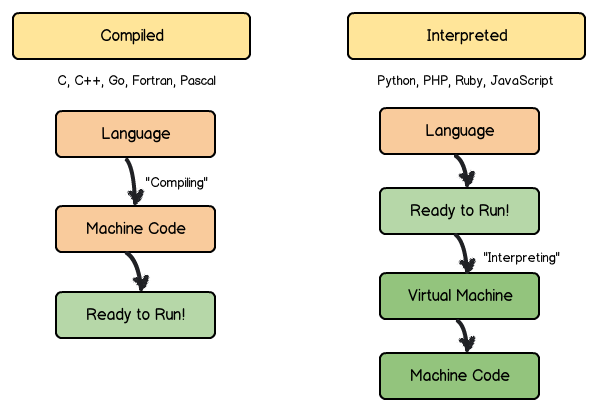

# GENERAL CONCEPTS

## Compiled vs. Interpreted


- In theory, languages can be either

- Interpreted language: interpreter parses and executes commands
  - +: portable, easier to debug
  - -: slow
    - Parsed, interpreted, and executed every time
  - Ex.: JS, Ruby, PHP, Python


- Compiled: converts to assembly language (depending on machine) --> binary code
  - +: fast
    - Overhead for the translation is incurred just once, when the source is compiled; thereafter, it need only be loaded and executed
  - -: only works on platform designed for
  - Ex.: C/C++, Go, Fortran

## Programming Paradigms
- **Procedural**: explicit statements (variable assignment, etc.) that change program state
- **Declarative**: specifying the result you want, not how to get it
  - Ex.: SQL


- **Imperative**: explicit (shows how computation takes place) sequence of commands that update state
- **Logical**: specifying a set of facts and rules
- **Functional**: type of declarative, function calls that avoid any global state
  - +: avoid shared state and side effects, potential for refactoring and optimization bc of focus on what to do
  - -: steeper learning curve
- **Object-oriented**: defining objects that have their own internal (encapsulated) state and public interfaces
  - **Class-Based** and **Prototype-Based**
  - +: readable, easy to learn
  - -: depends on shared state, behaviors accessed by multiple functions, can cause **race conditions**
  - Ex.: Ruby, Java, C#, C++


## Object Composition > Class Inheritance
- **Inheritance**: design based on what they are
  - Need to work out the taxonomy in advance, prone to design mistakes
- **Composition**: design based on what they do
  - ```Object.assign({}, ...)```
- Use can-do, has-a, or uses-a relationships instead of is-a relationships
  - Avoids class hierarchies, brittle base class problem, coupling


## Sources
Compiled vs Interpreted
https://kb.iu.edu/d/agsz
https://www.ibm.com/support/knowledgecenter/zosbasics/com.ibm.zos.zappldev/zappldev_85.htm

https://medium.com/javascript-scene/10-interview-questions-every-javascript-developer-should-know-6fa6bdf5ad95
