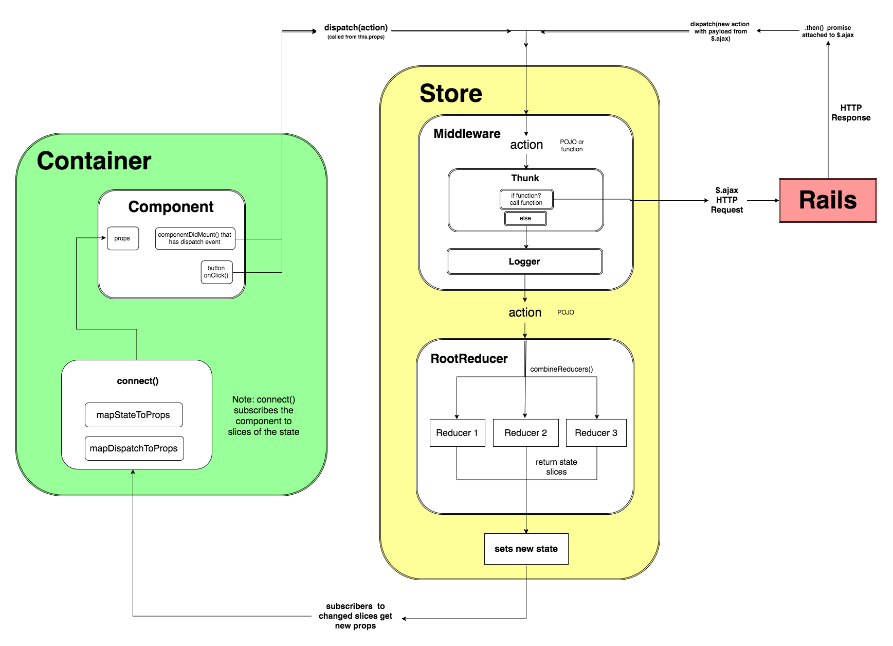

# JAVASCRIPT CONCEPTS

## React vs. Redux

- Redux: yellow, the store, the single-source of truth
- React: green

## Redux Store
- **Store**: central element of Redux's architecture w global state of an app, immutable
  - It 1. updates app's state via reducer 2. broadcasts state to an application's view layer via subscription 3. listens for actions that tell it how and when to change the global state
- ```createStore(reducer, [preloadedState], [enhancer])```
  - reducer (required): reducing function that receives the app's current state and incoming actions, determines how to update the store's state, and returns the next state
- Methods
  - ```getState()```: returns the store's current state.
  - ```dispatch(action)```: passes an action into the store's reducer telling it what information to update
  - ```subscribe(callback)```: registers callbacks to be triggered whenever the store updates (returns function, which when invoked, unsubscribes the callback function from the store)
